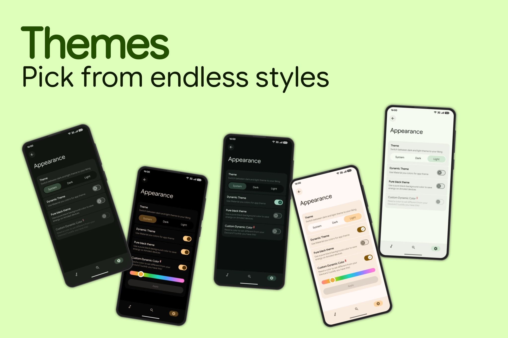
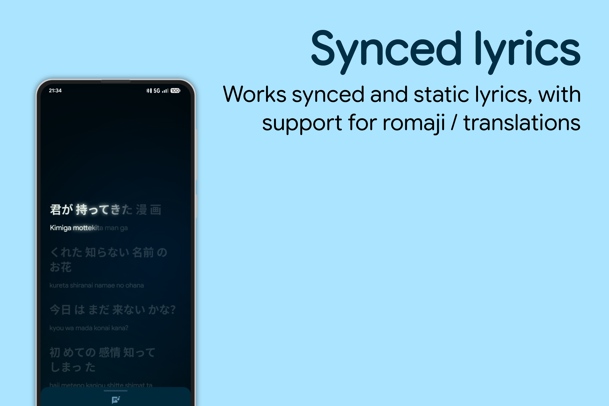
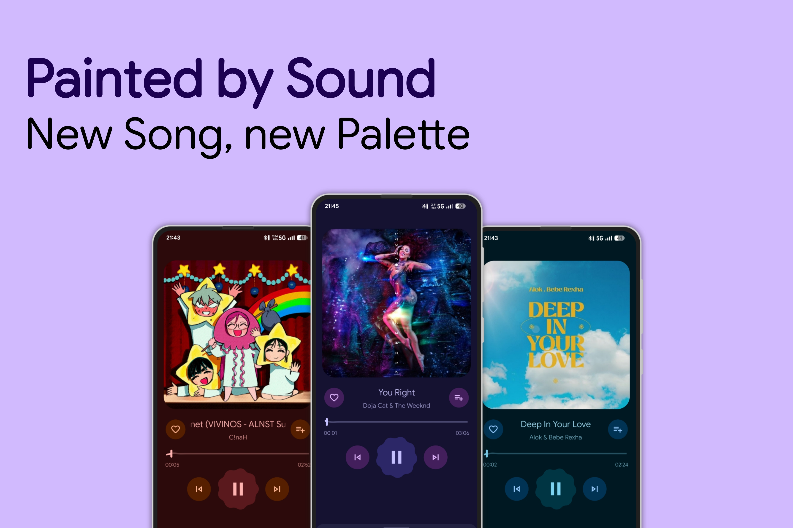

<div align="center">

# 🎵 Tunexa

**A modern, aesthetic Material 3 Expressive music player for Android.**

[](https://android.com)
[](https://openjdk.org)
[](LICENSE)
[](https://m3.material.io)

</div>

---

## 🌟 Overview

**Tunexa** is an elegant, high-performance music player crafted for Android. Designed with Google's Material 3 Expressive guidelines, Tunexa delivers a fluid, gesture-driven listening experience with dynamic album artwork palettes, high-resolution audio streaming, full offline library support, and a beautifully refined interface.

---

## ✨ Features

### 🎨 Material 3 Expressive Interface
- **Dynamic Palette Theming**: The entire player dynamically adapts its color scheme to match the album artwork of whatever track is currently playing.
- **Sleek Mini-Player**: Minimalist, distraction-free collapsed player with borderless controls, clean typography, and real-time playback progress indicator.
- **Fluid Gestures & Transitions**: Smooth draggable bottom-sheet player with full predictive back gesture animations.
- **Dark & OLED Black Modes**: Built-in support for system dark mode and true OLED pitch-black contrast.

### 🎧 Core Playback Engine
- **AndroidX Media3 & ExoPlayer**: Industry-standard audio engine with seamless gapless playback.
- **System MediaSession**: Full lockscreen media controls, Bluetooth headset controls, and dynamic media notification integration.
- **Speed & Pitch Control**: Fine-grained playback speed and pitch adjustment with optional tempo locking.
- **Audio Equalizer Waves**: Interactive animated VuMeter indicators showing active playback across lists and search results.

### 📋 Interactive Playing Queue
- **Bottom-Sheet Queue Manager**: View your upcoming playlist anytime with a single tap.
- **Drag-to-Reorder**: Reorder tracks on the fly using smooth drag handles (`ItemTouchHelper`).
- **Swipe or Tap to Remove**: Instantly manage your queue or jump directly to any song.

### 📝 Synchronized Lyrics
- **Dedicated Lyrics View**: Full-screen, high-contrast synchronized lyrics display with smooth line scrolling.
- **Zero UI Overlap**: Intelligent mutual-exclusion transitions keep the lyrics screen independent of album art and player controls.
- **Quick Dismiss**: Built-in top header dismiss chevron and Android back-gesture support.

### 🔍 Discovery & Online Search
- **Curated Explore Screen**: Categorized playlists for *New Releases*, *Charts*, *Moods & Genres*, and *Podcasts*.
- **YouTube Music Catalog**: Streamlined online song discovery and recommendations alongside your local media library.
- **Ultra High-Definition Artwork**: Automatically enhances stream thumbnails to crisp 1080p+ album artwork.

### 🔒 100% Private & Ad-Free
- No advertisements.
- No user tracking or analytics.
- No accounts, sign-ins, or cloud lock-in.

---

## 📱 Screenshots

<div align="center">
  
  
  
</div>

---

## 🛠️ Building from Source

### Prerequisites
- **Android Studio Ladybug (2024.2+)** or newer
- **JDK 17 or JDK 21**
- **Android SDK Platform 34+**
- Minimum SDK: **API 26 (Android 8.0)** | Target SDK: **API 35+**

### Build Steps

1. **Clone the repository:**
   ```bash
   git clone https://github.com/tirthgoyani11/tunexa.git
   cd tunexa
   ```

2. **Assemble Release APK:**
   ```bash
   ./gradlew assembleRelease
   ```

3. **Install to connected device:**
   ```bash
   adb install -r app/build/outputs/apk/release/app-arm64-v8a-release.apk
   ```

---

## 📋 Requirements

- Android 8.0 (Oreo / API 26) or higher.
- ARM64-v8a or ARMv7a device architecture.

---

## 📄 License

Tunexa is open-source software licensed under the **GNU General Public License v3.0 (GPLv3)**. See the [LICENSE](LICENSE) file for details.
